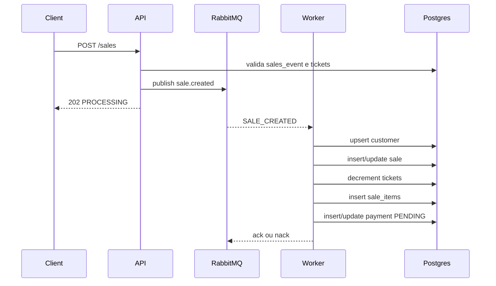
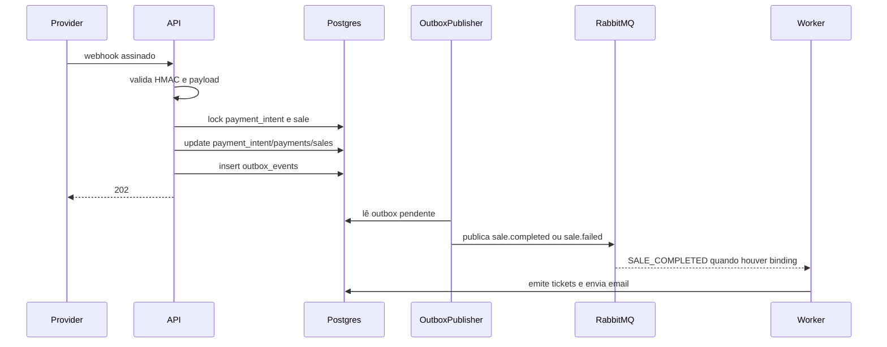

# Flows

## Fluxo 1: criação de venda e reserva assíncrona

### Resumo

- Entrada: `POST /sales`
- Efeito: API valida e enfileira `SALE_CREATED`; worker reserva estoque e persiste a venda.

### Diagrama

### Pontos do fluxo

1. Ponto de entrada
   - `internal/httpapi/router.go`, rota `POST /sales`.
2. Validações
   - campos obrigatórios;
   - formato do email;
   - existência do evento;
   - existência do ticket no evento;
   - preço informado igual ao preço do banco;
   - quantidade menor ou igual ao estoque visível no momento.
3. Serviço principal
   - publish do evento `events.SaleCreated`.
4. Chamadas internas
   - `validateSaleRequest`
   - `SalesEventExists`
   - `GetTicketForEvent`
   - `Broker.PublishJSON`
5. Acesso ao banco
   - apenas leitura na API;
   - escrita transacional no worker.
6. Integrações externas
   - RabbitMQ.
7. Mensageria
   - publica `sale.created`;
   - worker consome `sales.created.queue`.
8. Tratamento de erros
   - falha de validação retorna `400`;
   - falha ao publicar retorna `503`;
   - falha no worker gera `Nack(false, false)`.
9. Resposta/efeito final
   - resposta HTTP `202` com `saleId` e `PROCESSING`;
   - persistência final acontece depois.
10. Arquivos envolvidos
   - `internal/httpapi/router.go`
   - `internal/worker/sales_processor.go`
   - `internal/messaging/rabbitmq.go`

### Risco relevante

- `Fato confirmado`: a API aceita antes da reserva definitiva, então `202` não significa estoque reservado com sucesso.

## Fluxo 2: criação de payment intent

### Resumo

- Entrada: `POST /sales/:saleId/payment-intents`
- Efeito: cria ou atualiza uma `payment_intent` pendente e ajusta `payments`.

### Pontos do fluxo

1. Ponto de entrada
   - `internal/httpapi/router.go`
2. Validações
   - `saleId` UUID;
   - `amount > 0`;
   - `provider` obrigatório;
   - venda precisa estar `PENDING_PAYMENT`;
   - valor deve ser igual ao `total_amount`.
3. Serviço principal
   - `PostgresSalesStore.CreatePaymentIntent`
4. Banco
   - lock e leitura da venda;
   - upsert em `payment_intents`;
   - update em `payments`.
5. Integrações externas
   - nenhuma integração real com gateway foi encontrada.
6. Resposta final
   - `202 Accepted` com dados da intenção.

### Observação

- `Inferência`: o sistema prepara a integração com gateway, mas hoje gera `provider_reference` e `client_secret` localmente.

## Fluxo 3: confirmação de pagamento por webhook

### Resumo

- Entrada: `POST /webhooks/payments`
- Efeito: valida HMAC, atualiza `payments`, muda status da venda, grava evento na outbox.

### Diagrama

### Pontos do fluxo

1. Ponto de entrada
   - `internal/httpapi/router.go`, rota `/webhooks/payments`.
2. Validações
   - assinatura HMAC do corpo;
   - `paymentIntentId` UUID;
   - coerência entre intent, venda, provider e amount;
   - `occurredAt` obrigatório.
3. Serviço principal
   - `PostgresSalesStore.ProcessPaymentWebhook`.
4. Chamadas internas
   - `getPaymentIntent`
   - `getSaleForPayment`
   - `processPaymentTx`
   - `paymentOutboxPayload`
5. Banco
   - update em `payment_intents`;
   - upsert em `payments`;
   - update em `sales`;
   - possível devolução de estoque;
   - insert em `outbox_events`.
6. Integrações externas
   - provedor envia webhook;
   - RabbitMQ é acionado depois, via outbox.
7. Tratamento de erros
   - assinatura inválida: `401`;
   - venda/intent inexistente: `404`;
   - conflito de status: `409`;
   - outros erros inesperados: `500`.
8. Resposta final
   - `202 Accepted` com estado da venda e pagamento.

### Risco relevante

- `Fato confirmado`: `SALE_FAILED` vai para outbox, mas não há fila declarada/bindada para `sale.failed`.
- `Fato confirmado`: o publish não usa publisher confirms nem `mandatory=true`, então um evento pode ser marcado como publicado sem rota válida no broker.

## Fluxo 4: publicação da outbox

### Resumo

- Entrada: ticker interno do worker
- Efeito: lê `outbox_events` pendentes/falhos e tenta publicar em RabbitMQ.

### Pontos do fluxo

1. Ponto de entrada
   - `internal/outbox/publisher.go`, método `Run`.
2. Seleção
   - busca eventos `PENDING` ou `FAILED`;
   - exige `published_at IS NULL`;
   - respeita `next_attempt_at`;
   - usa `FOR UPDATE SKIP LOCKED`.
3. Roteamento
   - `SALE_COMPLETED -> sale.completed`
   - `SALE_FAILED -> sale.failed`
4. Retry
   - em falha incrementa `attempts`, grava `last_error` e agenda `next_attempt_at`;
   - após 5 tentativas vira `DEAD_LETTER`.
5. Risco relevante
   - `PublishJSON` considera sucesso quando `channel.PublishWithContext` não retorna erro;
   - o código não confirma se havia fila ligada ao routing key.

## Fluxo 5: pagamento manual por API key

### Resumo

- Entrada: `POST /sales/:saleId/payments`
- Efeito: processa pagamento diretamente, sem exigir `payment_intent`.

### Evidência

- Handler em `internal/httpapi/router.go`
- Requer role `PAYMENT_PROVIDER` ou `ADMIN`.

### Risco

- `Inferência`: este endpoint pode contornar parte do fluxo esperado para providers externos.

## Fluxo 6: emissão e envio de tickets

### Resumo

- Entrada: mensagem `SALE_COMPLETED`
- Efeito: cria `issued_tickets`, registra email pendente, envia QR codes por email e marca status.

### Pontos do fluxo

1. Ponto de entrada
   - `internal/worker/ticket_delivery_processor.go`, método `Handle`.
2. Validações
   - unmarshal do evento;
   - venda deve estar `COMPLETED`;
   - email não pode já estar `SENT`.
3. Serviço principal
   - `prepareTicketEmail`
4. Banco
   - lock da venda;
   - leitura de `sale_items`;
   - insert idempotente em `issued_tickets`;
   - upsert em `email_notifications`;
   - update para `SENT` e `emailed_at`.
5. Integrações externas
   - SMTP ou logger fallback.
6. Tratamento de erros
   - falha de envio marca `FAILED`;
   - ticket já enviado resulta em skip.
7. Efeito final
   - QR codes gerados e enviados.

## Fluxo 7: retry de email

### Resumo

- Entrada: ticker interno do worker
- Efeito: reenvia emails em `FAILED` com backoff exponencial.

### Evidência

- `RunEmailRetries`
- `RetryFailedEmails`
- `emailRetryBackoff`

### Comportamento

- seleciona lote com `FOR UPDATE SKIP LOCKED`;
- carrega venda e tickets emitidos;
- tenta reenviar;
- em sucesso marca `SENT`;
- em falha incrementa `attempts` e agenda `next_retry_at`;
- após 5 tentativas vira `DEAD_LETTER`.

## Fluxo 8: eventos de email

### Resumo

- Entrada: `POST /webhooks/email-events`
- Efeito: atualiza rastreamento de entrega/abertura/clique/bounce.

### Pontos do fluxo

1. Proteção
   - header `X-Webhook-Secret`.
2. Validações
   - `saleId` UUID;
   - `eventType` permitido;
   - `occurredAt` obrigatório.
3. Persistência
   - update direto em `email_notifications`.

### Risco

- `Fato confirmado`: o update é por `sale_id`; se não existir linha em `email_notifications`, a API responde como se a venda não existisse.

## Fluxo 9: check-in

### Resumo

- Entrada: `POST /sales-events/:salesEventId/check-ins`
- Efeito: registra entrada única do ticket emitido.

### Pontos do fluxo

1. Autorização
   - role `CHECK_IN` ou `ADMIN`.
2. Validações
   - `salesEventId` UUID;
   - `ticketCode` com UUID válido.
3. Banco
   - busca ticket emitido com lock;
   - exige venda `COMPLETED` e pagamento `APPROVED`;
   - insert em `ticket_check_ins`.
4. Respostas
   - sucesso: `201`;
   - duplicado: `409`;
   - ticket inexistente: `404`.
